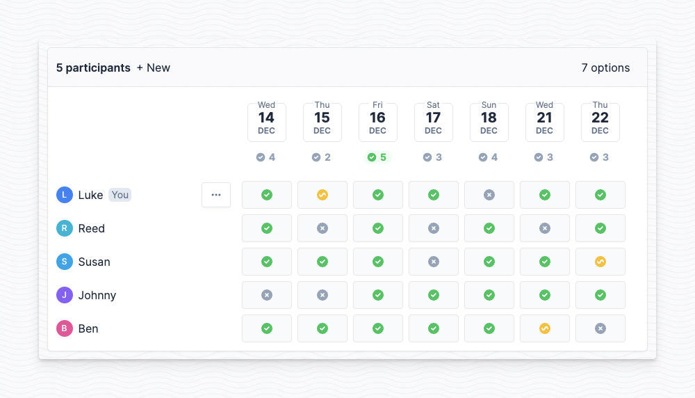

[](https://github.com/lukevella/rallly/actions)
[](https://crowdin.com/project/rallly)
[](https://www.gnu.org/licenses/agpl-3.0)
[](https://discord.gg/uzg4ZcHbuM)
[](https://www.paypal.com/donate/?hosted_button_id=7QXP2CUBLY88E)



Schedule group meetings with friends, colleagues and teams. Create meeting polls to find the best date and time to organize an event based on your participants' availability. Save time and avoid back-and-forth emails.

Built with [Next.js](https://github.com/vercel/next.js/), [Prisma](https://github.com/prisma/prisma), [tRPC](https://github.com/trpc/trpc) & [TailwindCSS](https://github.com/tailwindlabs/tailwindcss)

## Self-hosting

Check out the [self-hosting repo](https://github.com/lukevella/rallly-selfhosted) for more information on running your own instance of Rallly.

## Running locally

Clone this repo and change directory to the root of the repository.

```bash
git clone https://github.com/lukevella/rallly.git
cd rallly
```

Copy the sample `.env` file then open it and set the variables.

```bash
cp sample.env .env
```

_See [configuration](#configuration) to see what parameters are availble._

Install dependencies

```
yarn
```

Next, run the following to generate the database client and run migrations to create our schema

```
yarn db:generate && yarn db:deploy
```

Start the Next.js server

```
# For development
yarn dev
# For production
yarn build
yarn start
```

## Configuration Options

The app can be configured with the following environment variables.

| Environment Variable    | Default                | Description                                                                                                                                     |
| ----------------------- | ---------------------- | ----------------------------------------------------------------------------------------------------------------------------------------------- |
| `AUTH_REQUIRED`         | `false`                | Set to `true` to require authentication for creating new polls and accessing admin pages                                                        |
| `ALLOWED_EMAILS`        | `""`                   | Comma separated list of email addresses that are allowed to register and login. Wildcard characters are supported. Example: `*@yourcompany.com` |
| `DISABLE_LANDING_PAGE` | `false`                | Whether or not to disable the landing page                                                                                                      |
| `NEXT_PUBLIC_BASE_URL`  | `http://localhost:300` | The base url where this instance is accessible, including the scheme (eg. `http://` or `https://`), the domain name, and optionally a port.     |
| `SECRET_PASSWORD`       | `""`                   | A random 32-character secret key used to encrypt user sessions                                                                                  |
| `SMTP_HOST`             | `localhost`            | The host address of your SMTP server                                                                                                            |
| `SMTP_PORT`             | 25 or 465              | The port of your SMTP server                                                                                                                    |
| `SMTP_SECURE`           | false                  | Set to "true" if SSL is enabled for your SMTP connection                                                                                        |
| `SMTP_USER`             | `""`                   | The username (if auth is enabled on your SMTP server)                                                                                           |
| `SMTP_PWD`              | `""`                   | The password (if auth is enabled on your SMTP server)                                                                                           |

## Contributors

If you would like to contribute to the development of the project please reach out first before spending significant time on it.

### Translators 🇫🇷 🇩🇪 🇮🇹 🇪🇸

You can help translate Rallly to another language by following our [guide for translators](https://github.com/lukevella/rallly/wiki/Guide-for-translators).

## License

Rallly is open-source under the GNU Affero General Public License Version 3 (AGPLv3) or any later version. See [LICENSE](LICENSE) for more detail.

## Sponsors

Big thanks to these folks for sponsoring the project!

<a href="https://github.com/cpnielsen" target="_blank"></a>&nbsp;
<a href="https://github.com/iamericfletcher" target="_blank"></a>&nbsp;
<a href="https://github.com/arcticFox-git" target="_blank"></a>&nbsp;

And thanks to these companies for providing their services to host and run [rallly.co](https://rallly.co).

<a href="https://vercel.com/?utm_source=rallly&utm_campaign=oss"></a>
&nbsp;&nbsp;&nbsp;
<a href="https://m.do.co/c/f91efc9c9e50"></a>
&nbsp;&nbsp;&nbsp;
<a href="https://sentry.io"></a>
