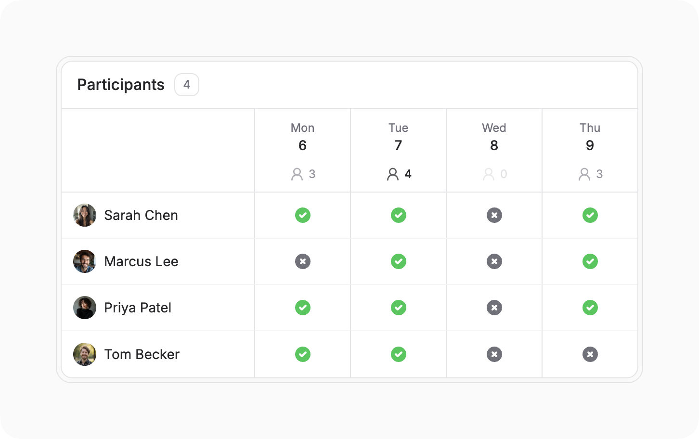

### Schedule group meetings, without the back-and-forth

  <a href="https://rallly.co"><strong>Website</strong></a> ·
  <a href="https://support.rallly.co"><strong>Documentation</strong></a> ·
  <a href="https://discord.gg/uzg4ZcHbuM"><strong>Discord</strong></a>

 

 

Rallly is an open-source scheduling tool that helps you find the best date and time to meet. Create a poll with a few options, share the link, and let your participants vote on when they're available. No more back-and-forth emails.

## ✨ Features

- 📅 **Date & time polls** — Propose multiple options and find what works for everyone
- 🗳️ **No account needed to vote** — Participants just open the link and respond
- 📊 **Availability grid** — See everyone's responses at a glance
- 💬 **Comments** — Discuss the details right on the poll
- 🔔 **Notifications** — Get notified when participants respond
- ✅ **Finalize a date** — Pick the winning option and notify everyone
- 🌍 **10+ languages** — Community-translated via [Crowdin](https://crowdin.com/project/rallly)
- 🔒 **Open source & self-hostable** — Own your data

## ☁️ Cloud version

The quickest way to get started is the hosted version. Create your first poll in seconds, no installation required.

**[Try Rallly free →](https://rallly.co)**

## 🐳 Self-hosting

Prefer to run your own instance? Rallly ships as a Docker image and can be self-hosted in minutes.

See the [self-hosting docs](https://support.rallly.co/self-hosting) for installation and [configuration options](https://support.rallly.co/self-hosting/configuration-options).

## 🛠️ Built with

[Next.js](https://github.com/vercel/next.js/) · [Prisma](https://github.com/prisma/prisma) · [tRPC](https://github.com/trpc/trpc) · [TailwindCSS](https://github.com/tailwindlabs/tailwindcss)

## 🤝 Contributing

Contributions are welcome! Have a look at the [contributing guide](CONTRIBUTING.md) to get started with local development and find out how you can help.

- 🌐 **Translators** — Help [translate Rallly](https://support.rallly.co/contribute/translations) into your language
- 🔐 **Security** — Found a vulnerability? See our [security policy](SECURITY.md)
- 🤝 **Community** — Please read our [Code of Conduct](CODE_OF_CONDUCT.md)

## 📜 License

Rallly is open-source under the GNU Affero General Public License Version 3 (AGPLv3) or any later version. See [LICENSE](LICENSE) for more detail.

## 💚 Sponsors

Thank you to our sponsors for making this project possible.

[Become a sponsor &rarr;](https://github.com/sponsors/lukevella)

 

