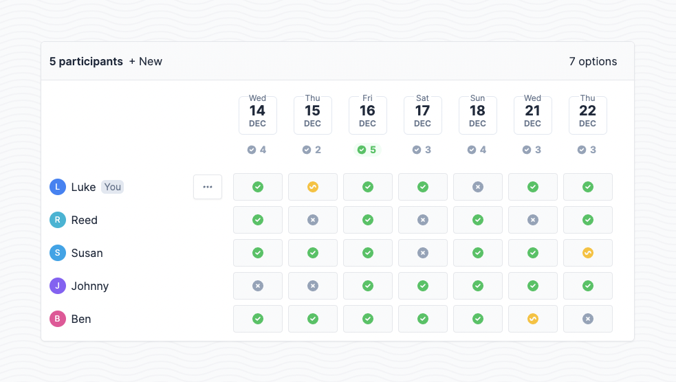

[](https://github.com/lukevella/rallly/actions)
[](https://crowdin.com/project/rallly)
[](https://www.gnu.org/licenses/agpl-3.0)
[](https://discord.gg/uzg4ZcHbuM)
[](https://www.paypal.com/donate/?hosted_button_id=7QXP2CUBLY88E)



Schedule group meetings with friends, colleagues and teams. Create meeting polls to find the best date and time to organize an event based on your participants' availability. Save time and avoid back-and-forth emails.

Built with [Next.js](https://github.com/vercel/next.js/), [Prisma](https://github.com/prisma/prisma), [tRPC](https://github.com/trpc/trpc) & [TailwindCSS](https://github.com/tailwindlabs/tailwindcss)

## Self-hosting

Check out the [self-hosting repo](https://github.com/lukevella/rallly-selfhosted) for more information on running your own instance of Rallly.

_[2023-01-12]: The docker configuration for self-hosters previously stored in this repo has been moved to the self-hosting repo mentioned above. Please switch to that repo if you are self-hosting._

## Running locally

Clone this repo and change directory to the root of the repository.

```bash
git clone https://github.com/lukevella/rallly.git
cd rallly
```

Copy the sample `.env` file then open it and set the variables.

```bash
cp sample.env .env
```

_See [configuration](#configuration) to see what parameters are availble._

Install dependencies

```
yarn
```

Next, run the database migrations to create our schema

```
yarn prisma migrate deploy
```

Start the Next.js server

```
# For development
yarn dev
# For production
yarn build
yarn start
```

## Configuration

| Parameter            | Default                                        | Description                                                                                                                         |
| -------------------- | ---------------------------------------------- | ----------------------------------------------------------------------------------------------------------------------------------- |
| NEXT_PUBLIC_BASE_URL | http://localhost:3000                          | The hosting url of the server, used for creating links and making api calls from the client.                                        |
| DATABASE_URL         | - | A postgres database URL. Leave out if using the docker-compose file since it will spin up and connect to its own database instance. |
| SECRET_PASSWORD      | -                                              | A long string (minimum 32 characters) that is used to encrypt session data.                                                         |
| SUPPORT_EMAIL        | -                                              | An email address that will appear as the FROM email for all emails being sent out.                                                  |
| SMTP_HOST            | -                                              | Host name of your SMTP server                                                                                                       |
| SMTP_PORT            | -                                              | Port of your SMTP server                                                                                                            |
| SMTP_SECURE          | false                                          | Set to "true" if SSL is enabled for your SMTP connection                                                                            |
| SMTP_USER            | -                                              | Username to use for your SMTP connection                                                                                            |
| SMTP_PWD             | -                                              | Password to use for your SMTP connection                                                                                            |

## Contributors

If you would like to contribute to the development of the project please reach out first before spending significant time on it.

### Translators 🇫🇷 🇩🇪 🇮🇹 🇪🇸

You can help translate Rallly to another language by following our [guide for translators](https://github.com/lukevella/rallly/wiki/Guide-for-translators).

## License

Rallly is open-source under the GNU Affero General Public License Version 3 (AGPLv3) or any later version. See [LICENSE](LICENSE) for more detail.

## Sponsors

Big thanks to these folks for sponsoring the project!

<a href="https://github.com/cpnielsen" target="_blank"></a>&nbsp;
<a href="https://github.com/Daedalus3" target="_blank"></a>&nbsp;
<a href="https://github.com/iamericfletcher" target="_blank"></a>&nbsp;
<a href="https://github.com/richb-hanover" target="_blank"></a>&nbsp;

And thanks to these companies for providing their services to host and run [rallly.co](https://rallly.co).

<a href="https://vercel.com/?utm_source=rallly&utm_campaign=oss"></a>
&nbsp;&nbsp;&nbsp;
<a href="https://m.do.co/c/f91efc9c9e50"></a>
&nbsp;&nbsp;&nbsp;
<a href="https://sentry.io"></a>
